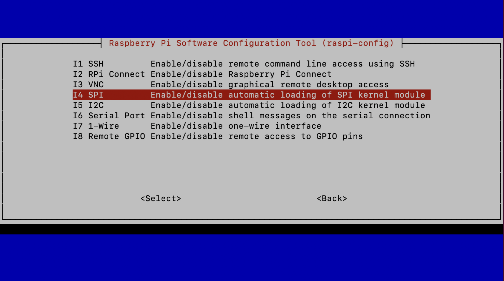
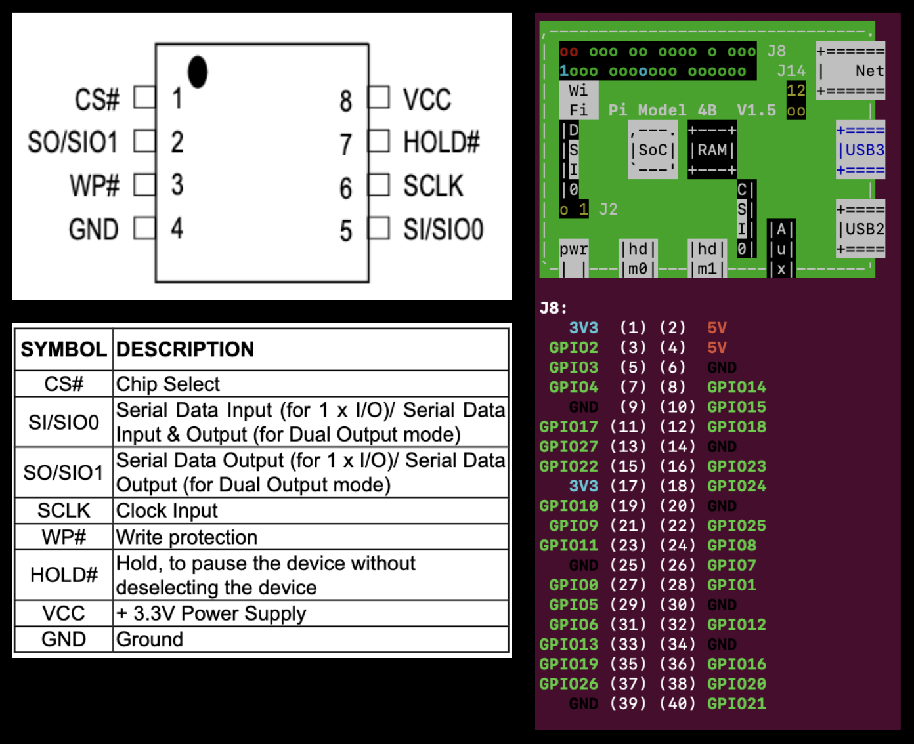

# Thinkpad T420 coreboot + SeaBIOS guide
This is a guide on externally flashing [coreboot](https://www.coreboot.org/) + [SeaBIOS](https://www.coreboot.org/SeaBIOS) payload onto a Lenovo Thinkpad T420. If you do not have a T420, some stuff in this guide may apply, however safer alternatives like [skulls](https://github.com/merge/skulls) and [Ivyrain](https://1vyra.in/) also exist for other models. Flashing can be done with either a CH341A USB programmer + Linux, or a SOIC8 Clip + Jumper Wires + Raspberry Pi.
## Materials Needed
* **Thinkpad T420**
* **PH0 screwdriver**
* **Basic Linux skills**
* **Raspberry Pi running Raspbian** *(Note: Flashing is easier on Raspbian as the GPIO pins, SPI, and I2C are easily configurable. If you are running another distribution, you may require additional configuration)*
* **Female to Female Dupont Jumper wires** *(Note: Not necessary if using a CH341A USB below)*
* **SOIC8 Clip** *(Note: The [Pomona clip](https://www.amazon.com/Pomona-Electronics-5250-Plated-Spacing/dp/B00JJ4G13I/ref=sr_1_2?crid=1R2NGULBCMQWC&dib=eyJ2IjoiMSJ9.MgDkCNLP219eQHD9nenoMCRit2rUwnzhZ6KkErstoI8PYaYZMB0r9CsnHyGU4AvrjWQUYUTpVbAwnWa0j59LKD6bGDTnJ9rfggneDb3Ai1YKdd1Q8piCpKY5anQZdZvXOMypXf0WlR9xUXOVvfDKsI915t7fjfVEw3EfmWLNvE0zJ__KYE9SoJ-z0M-fYdo-gITfZa5Nr3FLfzWsGwdFCC4MemKXdNvWFdSv3ENzoJ6pTNTVHoWraBdu0j0Vn0stYcN8Op2RySLmGveOvDhXZ20lu-gddV5RrVnmhEDeyEM.Y7jw5JXj0mq4metg3JLFDT7sEVQsj7bMMbl078PllSA&dib_tag=se) is the most reliable, however cheaper alternatives like a [CH341A USB](https://www.amazon.com/Organizer-Socket-Adpter-Programmer-CH341A/dp/B07R5LPTYM/ref=sr_1_4?crid=33CF6XMPFSQAR&dib=eyJ2IjoiMSJ9.UzyR0qbHGqQm_D9pv0cdFLsJG8gxrPg6g9QGljrxG3UckPrKJwzKDvCKTVh5lEs7uL4ncRktrvdmi7KD6U2EVRR-1NfaE1oPAqjkgGDIIMI_ftmky4cOdQFhR80QFODrsbzWd6k8_1UrUs0bnT5M7__4fScTWsJdkX7HzhlvNJw6RVO72Bd5XTuKArpyT2GcjdFp54UviQgykaHXn4QiAVerkytmpOH_hRqi5JzyHYjh8uJDom40ur3Pelzpg5UgvEzRe2Fj8xOhpkOBCDtBouX7HMLc5kwV_v2hCd0HuAA.7avPI0fja_C0nAdC7wtPyDRzKKkhku0Yze9gy0jCG5o&dib_tag=se) programmer work just as fine. I used these [SDK08](https://www.amazon.com/SDK08-Ultra-Small-Micro-Adapters/dp/B0B4DHVDRV/ref=sr_1_1?crid=1CRHV7QGG2RYM&dib=eyJ2IjoiMSJ9.8AiBpRWPYXwbD6Zez8PI5TgMvDEh0XYjt6qvKokkQK-4bJ1K57zlrYJkjIhGWH7yqOUlwQM3eGHGefVBIh1HfITFfhWmIxoOjxCwhxAjQ0UxCSNuliR-cEU3B_0QdEOdL6DcXwhMHS0wjCayDUXmyPd2j67NsQ4RaJnUAAr1vcpJal5os-0hzXRWM1X2ijOslYXkfneYVFdbr3_c2-cq8CzU7MfLBlSPbrANeWEttoUBHjLtqoFigynXiF0knB75ewELQL0c6u9pWyUFmr40jkp-eZRTWY6I80iL7aoHZBQ.kGqC-M37OcSo3nNiVPz0JMGLJla_oADZxqlFvJm4yzs&dib_tag=se) clips)*
* **Another computer to build coreboot on** *(Note: coreboot can be compiled on the Raspberry Pi, but it will take many hours and even days to compile. I highly recommend using another linux machine. I used a virtual machine running Debian)*

## Raspberry Pi Setup
**Before connecting any pins to the chip**, the coreboot environment must be set up. Log into your Raspberry Pi either headless or with a display connected. Run
```
$ sudo raspi-config
``` 
to open up the RPi config menu. Open the `3 Interface Options` choice on the first page. The following menu will appear:



Enable `I4 SPI` and `I5 I2C`. If you are running the RPi headless, also enable `I8 Remote GPIO`. Exit the menu when done.

The `flashrom` utility is also required, which can be installed by 
```
$ sudo apt install flashrom
```
Once flashrom is installed, you can `sudo poweroff` and disconnect power to the RPi. 


## Disassembly
Unfortunately, accessing the EEPROM chip requires basically a full disassembly of the laptop. The chip is underneath the magnesium structure protecting the motherboard, and sits just below the trackpad. Fortunately, Lenovo has an excellent [T420 hardware maintenance manual](https://download.lenovo.com/ibmdl/pub/pc/pccbbs/mobiles_pdf/t420_t420i_hmm.pdf) with diagrams of the disassembly process. 

When you have fully disassembled the laptop, you should have access to the chip. The below red arrow indicates the chip.


## Attaching wires
**Note: DO NOT CONNECT JUMPER WIRES WHILE THE RPi IS POWERED ON. ENSURE THE RPi IS OFF BEFORE CONNECTING WIRES** \
The model of the chip is written on the EEPROM, for the T420, the chip is the [Macronix MX25L6406E](https://www.macronix.com/Lists/Datasheet/Attachments/8630/MX25L6406E,%203V,%2064Mb,%20v1.9.pdf), the specsheet gives the pinout for the chip. *(Note: the black dot is the physical indentation on the chip, not the painted pink dot)*

Following [flashrom's suggestions](https://wiki.flashrom.org/RaspberryPi) for pin connections, the final pins to connect with jumpers and clips are as shown in the table and accompanying diagram:

| EEPROM PIN # | EEPROM PIN HEADER | RPi PIN # |
|---|---|---|
1|CS#|24
2|SO|21
3|WP#|See below
4|GND|25
5|SI|19
6|SCLK|23
7|HOLD#|See below
8|VCC|17



For pins 3 and 7 (WP# and HOLD#), flashrom says the following: 
> In general the other pins (usually pin 3 is /WP and pin 7 is /HOLD) should be connected to Vcc unless they are required to be floating or connected to GND (both extremely uncommon for SPI flash chips). Please consult the datasheet for the flash chip in question. 

However, you may encounter the issue where you run out of 3V3 pins to connect. In this case, it's best to connect pins 3 and 7 to any ground (GND) pins on the RPi. I was able to flash successfully while not connecting anything to pins 3 and 7, but YMMV, and it is better to connect to ground.

If you are running raspbian, you can enter the command 
```
$ pinout
``` 
and get a similar diagram as the one shown above. Additionally, [pinout.xyz](https://pinout.xyz/) has a more friendly-looking layout of the pins.

If using a CH341A USB programmer, you do not need to worry about pinouts, simply clip the chip such that the colored wire aligns with the first pin (indicated by the physical black indent on the chip) and ensure the clip is secure.

## Reading and build prep
Once all the pins are connected, connect power to the RPi. To test if chip is detected, run the command:
```
$ flashrom -p linux_spi:dev=/dev/spidev0.0,spispeed=512 
...
Found Macronix flash chip "MX25L6406E/MX25L6408E" (8192 kB, SPI) on linux_spi.
```
flashrom should automatically detect the chip and its model number. If the chip is not detected, check the following:
* Make sure the clip(s) have a secure connection to the RPi
* Ensure that the SPI, I2C and GPIO configuration are done correctly
* Run `sudo apt upgrade` and reboot the RPi
---
Create a folder to store the rom backups in a location of your preference with `mkdir` and `cd` to that folder. Then read the contents of the chip to a file with
<pre>
$ flashrom -p linux_spi:dev=/dev/spidev0.0,spispeed=512 -c "<i>chipname</i>" -r <i>filename</i>
...
Reading flash... done.
</pre>
replacing *chipname* with the chip name that flashrom previously detected (in my case, *chipname=* `MX25L6406E/MX25L6408E`) and replacing filename with the name of the output file where the read contents will be stored. 

Note the reading process may take a few minutes. If you would like to speed it up, you can change the `spispeed=` value, say to 1024 instead of 512. Generally slower speeds are more reliable, but I haven't had any issues with 512 or 1024. I'll stick to 512 for now.

Optionally, you can add the `-V` verbose option at the end to print more debug messages.

---

Read the chip three times, saving the contents of the chip to three **different** files. After reading, calculate the MD5 sum of the files. My files saved to files romcopy1.bin, 2, 3, so I would run
```
$ md5sum romcopy1.bin romcopy2.bin romcopy3.bin
75a3a3a4b3fa5231850a806f2ff5d0a6  romcopy1.bin
75a3a3a4b3fa5231850a806f2ff5d0a6  romcopy2.bin
75a3a3a4b3fa5231850a806f2ff5d0a6  romcopy3.bin
```
If the md5 sums of all the files do not match, **DO NOT CONTINUE.** This means you got a bad read, and you need to recheck your pin connections and make sure all connections are secure and stable. 
### (Optional) Intel ME Cleaner
Optionally, you can clean the Intel Management Engine from your coreboot build using [me_cleaner](https://github.com/corna/me_cleaner). If you don't already have git, install it with `sudo apt install git`, then run the following:
<pre>
$ git clone https://github.com/corna/me_cleaner
$ python ./me_cleaner/me_cleaner.py -S <i>pathtoinputfile</i> -O <i>pathtooutputfile</i>
</pre>
replacing *pathtoinputfile* with the path to one of the original rom copies, and replacing *pathtooutputfile* with the path to the cleaned rom copy that me_cleaner will create. Note: you may need to run the second command with `sudo` if you get a permission error.

### (Optional) Alias flashrom
If typing the same line over and over is tedious, you can create an alias for it, for example:
```
$ alias flashromalias='flashrom -p linux_spi:dev=/dev/spidev0.0,spispeed=512'
```
Then test it by running 
```
$ flashromalias
...
Found Macronix flash chip "MX25L6406E/MX25L6408E" (8192 kB, SPI) on linux_spi.
```
which will run the alias. The alias will be erased after rebooting, and you need to set it again to use it.

## Compiling coreboot
On the second (hopefully more powerful) Linux computer, [a few more tools](https://doc.coreboot.org/tutorial/part1.html#download-configure-and-build-coreboot) are needed for coreboot to compile correctly.

For Debian based distros:
```
$ sudo apt-get install -y bison build-essential curl flex git gnat libncurses5-dev libssl-dev m4 zlib1g-dev pkg-config
```
For Arch-based distros:
```
$ sudo pacman -S base-devel curl git gcc-ada ncurses zlib
```
---
Change directory into a folder you would like to put the coreboot environment in, then clone the coreboot repo with:
```
$ git clone --recursive https://review.coreboot.org/coreboot.git
```
Then, change directory to the ifdtool directory and install the ifdtool
```
$ cd ./coreboot/util/ifdtool
$ sudo make install
```
---
The ifdtool is used to seperate the existing rom into 4 flash regions. Therefore we need to transfer a copy of the rom to our second computer. If you use me_cleaner, you should transfer the cleaned copy. You can use a flash drive, or a program such as [scp](https://linux.die.net/man/1/scp) to transfer over network. 

Once you have the rom binary on the computer you will compile coreboot on, navigate to it and run the ifd tool. For my cleaned rom, I ran
```
$ ifdtool -x rom_cleaned.bin
$ ls
flashregion_0_flashdescriptor.bin  flashregion_3_gbe.bin
flashregion_1_bios.bin             rom_cleaned.bin   
flashregion_2_intel_me.bin
```

Only the flashdescriptor, intel_me, and gbe files are needed. Rename the files so that coreboot can autodetect the files when we move them later.
```
$ mv flashregion_0_flashdescriptor.bin descriptor.bin
$ mv flashregion_2_intel_me.bin me.bin
$ mv flashregion_3_gbe.bin gbe.bin
```
---

